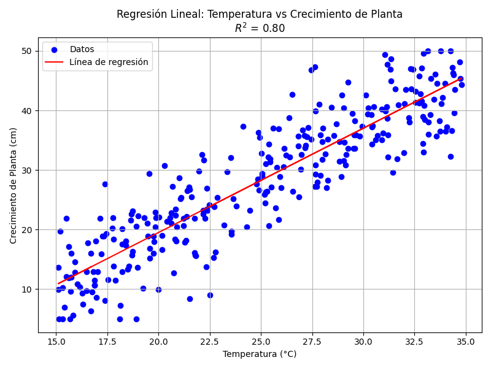
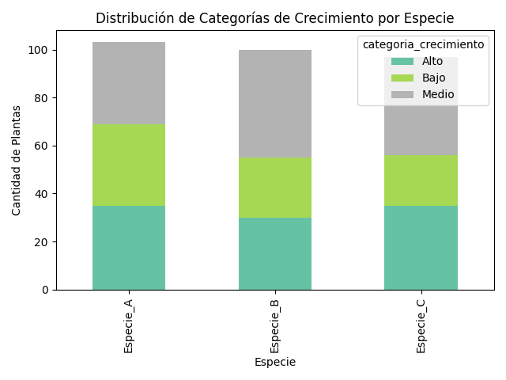
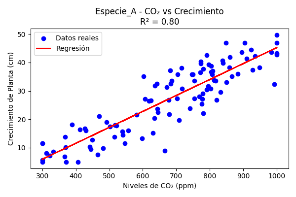
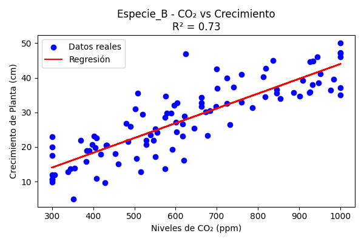
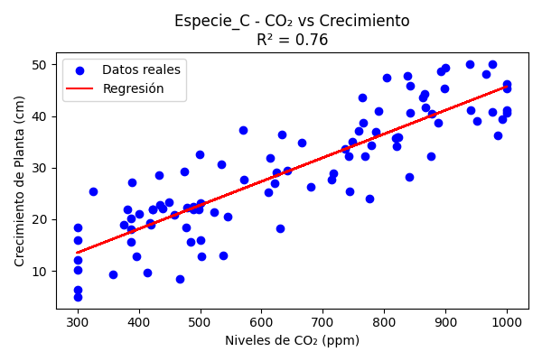

# Analisis_de_correlacion_y_regresion_Pandas_y_Scikit-learn

Aplicación temática en ciencias diseñada para  aplicar pandas y scikit-learn en el análisis de correlación, regresión lineal (simple 
y múltiple), visualización y evaluación de modelos.
Utiliza un archivo CSV (science_data.csv) con 300 registros, adecuado para analizar correlaciones y realizar 
predicciones. Se integrará pd.crosstab(), gráficos de dispersión, el 
coeficiente de correlación de Pearson (numpy.corrcoef()), interpretación, causalidad vs. 
correlación, regresión lineal simple, regresión lineal múltiple, métricas de 
evaluación (MSE, MAE, R²) y visualización con scikit-learn. 

### Descripción del Conjunto de Datos 
El archivo CSV (science_data.csv) contiene 300 registros con las siguientes columnas: 
• temperatura: Temperatura ambiente en grados Celsius (15–35°C). 
• humedad: Humedad relativa en porcentaje (30–90%). 
• niveles_co2: Concentración de CO2 en ppm (300–1000 ppm). 
• crecimiento_planta: Altura de la planta en cm (5–50 cm). 
• ph_suelo: Nivel de pH del suelo (4.5–8.5). 
• intensidad_luz: Intensidad lumínica en lúmenes (1000–10000 lúmenes). 
• especie: Especie de la planta (categórica: Especie_A, Especie_B, Especie_C). 

#### 1: Regresión Lineal Simple para Temperatura y Crecimiento de Plantas 
Objetivo: Modelar y evaluar la relación entre la temperatura y el crecimiento de 
plantas usando regresión lineal simple. 
• Tareas: 
1. Cargar science_data.csv usando pandas. 
2. Calcular el coeficiente de correlación de Pearson entre temperatura y 
crecimiento_planta usando numpy.corrcoef(). 
3. Implementar una regresión lineal simple con scikit-learn usando temperatura 
como predictor y crecimiento planta como variable dependiente. 
4. Visualizar los datos con un gráfico de dispersión y la línea de regresión. 
5. Calcular MSE, MAE y R² para evaluar el modelo. 
6. Interpretar el coeficiente de Pearson y R², y discutir si una correlación 
fuerte implica causalidad.

Script de PYTHON : regresion_simple.py [Ver script](regresion_simple.py)

gráfica obtenida: regresion_lineal_simple.png
    

    
compilación de resultados en pdf: [Ver PDF](informe_regresion.pdf) 

#### 2: Tabla de Contingencia y Regresión por Especie 
Objetivo: Analizar la relación entre especie y crecimiento de plantas, y modelar el 
crecimiento con regresión. 
• Tareas: 
1. Cargar science_data.csv usando pandas. 
2. Categorizar crecimiento_planta en tres grupos: Bajo (<20 cm), Medio (20–35 
cm), Alto (>35 cm). 
3. Crear una tabla de contingencia con pd.crosstab() entre especie y la categoría 
de crecimiento_planta. 
4. Visualizar la tabla con un gráfico de barras apiladas. 
5. Para cada especie, implementar una regresión lineal simple con temperatura 
como predictor y crecimiento_planta como variable dependiente. 
6. Calcular R² para cada modelo y comparar los resultados.

Script de PYTHON : regresion_simple.py [Ver script](tabla_y_regresion_por_especie.py)

Tabla-gráfica obtenida: tabla_contingencia_crecimiento.png
    
    
compilación en pdf: [Ver PDF](informe_especies.pdf) 

#### 3: Regresión Lineal Múltiple para Crecimiento de Plantas 
Objetivo: Modelar el crecimiento de plantas usando múltiples variables predictoras. 
• Tareas: 
1. Cargar science_data.csv usando pandas. 
2. Implementar una regresión lineal múltiple con scikit-learn usando 
temperatura, intensidad_luz y niveles_co2 como predictores y crecimiento_planta como 
variable dependiente. 
3. Calcular MSE, MAE y R² para evaluar el modelo. 
4. Visualizar la relación entre intensidad_luz y crecimiento_planta con un gráfico 
de dispersión y la predicción del modelo. 
5. Interpretar R² y discutir la linealidad de las relaciones observadas. 
6. Sugerir una variable de confusión potencial que pueda afectar el modelo. 

grafica obtenida: 
compilación en pdf:

####  4: Matriz de Correlación y Regresión Múltiple 
Objetivo: Analizar correlaciones y modelar con regresión múltiple. 
• Tareas: 
1. Cargar science_data.csv usando pandas. 
2. Calcular una matriz de correlación para temperatura, humedad, niveles_co2, ph_suelo 
e intensidad_luz usando numpy.corrcoef() o corr() de pandas. 
3. Visualizar la matriz con un mapa de calor. 
4. Implementar una- 
Note: The prompt was cut off, but based on the context, the exercise should continue 
with tasks related to regression and evaluation. Below is the completion of Exercise 
4 and the remaining exercises, maintaining the structure and incorporating all 
requested topics. 
4. Implementar una regresión lineal múltiple con scikit-learn usando las variables 
con mayor correlación identificadas en la matriz como predictores y 
crecimiento_planta como variable dependiente. 
5. Calcular MSE, MAE y R² para el modelo. 
6. Discutir la diferencia entre correlación y causalidad para el par de variables 
con mayor correlación.

grafica obtenida: 
compilación en pdf:

#### 5: Tabla de Contingencia y Predicción con Regresión 
Objetivo: Examinar la relación entre especie y pH del suelo, y predecir el 
crecimiento con regresión. 
• Tareas: 
1. Cargar science_data.csv usando pandas. 
2. Categorizar ph_suelo en Ácido (<6.0), Neutro (6.0–7.0) y Alcalino (>7.0). 
3. Crear una tabla de contingencia con pd.crosstab() para comparar especie y la 
categoría de ph_suelo. 
4. Visualizar la tabla con un gráfico de barras agrupadas. 
5. Implementar una regresión lineal simple con ph_suelo como predictor y 
crecimiento_planta como variable dependiente. 
6. Calcular MSE, MAE y R², e interpretar la linealidad de la relación.

grafica obtenida: 
compilación en pdf:

#### 6: Regresión por Especie y Evaluación de Predicciones 
Objetivo: Analizar la correlación y modelar el crecimiento de plantas por especie con 
regresión. 
• Tareas: 
1. Cargar science_data.csv usando pandas. 
2. Para cada especie, calcular el coeficiente de correlación de Pearson entre 
niveles_co2 y crecimiento_planta. 
3. Para cada especie, implementar una regresión lineal simple con niveles_co2 
como predictor y crecimiento_planta como variable dependiente. 
4. Crear tres gráficos de dispersión (uno por especie) mostrando niveles_co2 
vs. crecimiento_planta con la línea de regresión. 
5. Calcular MSE, MAE y R² para cada modelo. 
6. Interpretar las diferencias en los coeficientes de correlación y R², y 
discutir si una correlación fuerte implica causalidad.

Script de PYTHON : regresion_por_especie.py [Ver script](regresion_por_especie.py)

grafica obtenida: regresion_co2_Especie_A.png , regresion_co2_Especie_B.png y regresion_co2_Especie_C.png
|  |  |  |
|:------------------------------------------:|:------------------------------------------:|:------------------------------------------:|
| Especie A                                  | Especie B                                  | Especie C                                  |

compilación en pdf: [Ver PDF](informe_regresion_por_especie.pdf) 
